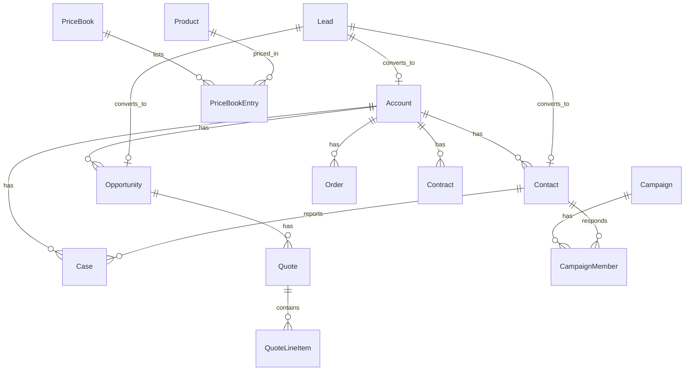
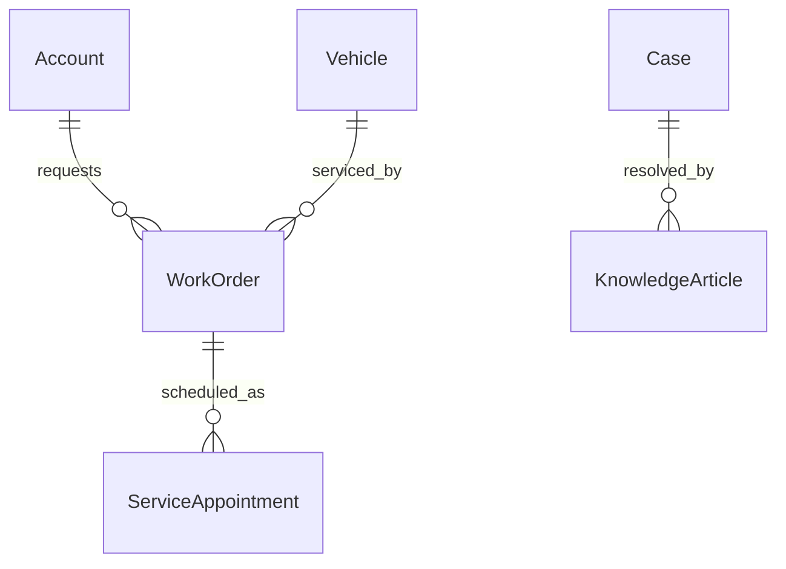
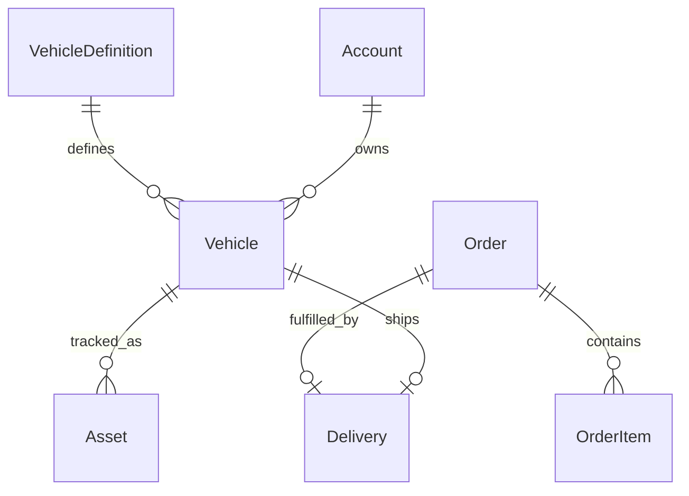

# Forcelet data model

Built by **Suresh Itha**. 24 standard objects, all definable at runtime.

## Core CRM

## Service

## Automotive (Auto Cloud style)

Vehicle lifecycle: `In Stock → Reserved → Sold → In Service → Delivered`.
Orders auto-number (`ORD-000001…`); activating an order auto-creates a
scheduled delivery; completing a delivery marks the vehicle delivered.

## Field types

Text, TextArea, Number, Currency, Date, DateTime, Checkbox, Picklist,
MultiPicklist, Lookup, Email, Phone, URL, Encrypted.

Plus: formula fields, roll-up summaries (sum/avg/min/max/count with filters),
auto-number via triggers, external IDs with upsert.

## Automation inventory (seeded)

| Kind | Examples |
|---|---|
| Triggers (code) | Order/delivery/contract/work-order/article numbering, VIN validation, lead stage→probability, block account delete with open opps |
| Validation rules | Contract dates, event end ≥ start, delivery dates, VIN length |
| Flows | Order activation → delivery; appointment completion → work order completion; delivery completion → vehicle delivered |
| Approval processes | Discount approval (seeded) |
| Paths | Vehicle lifecycle, order fulfillment, work order service |
| Assignment | Round-robin web leads |
| Scheduled jobs | Close-date reminders, case SLA monitor |
| Duplicate rules | Lead email, VIN |
| Sharing rules | Criteria-based (seeded examples) |
| SLA policies | First-response / resolution targets by priority, breach escalation |
