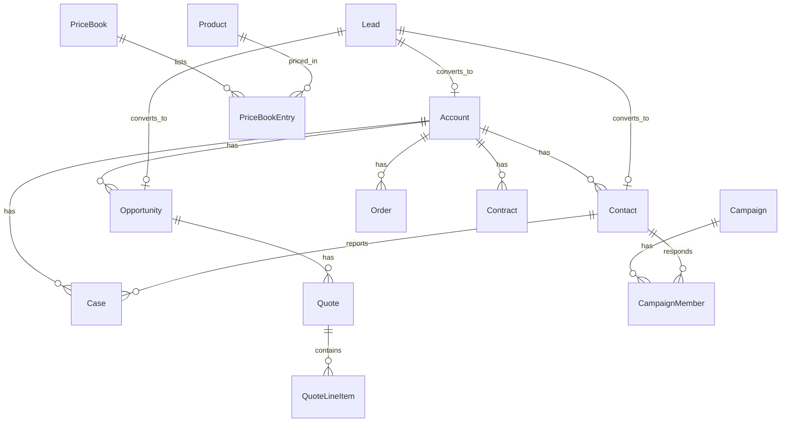
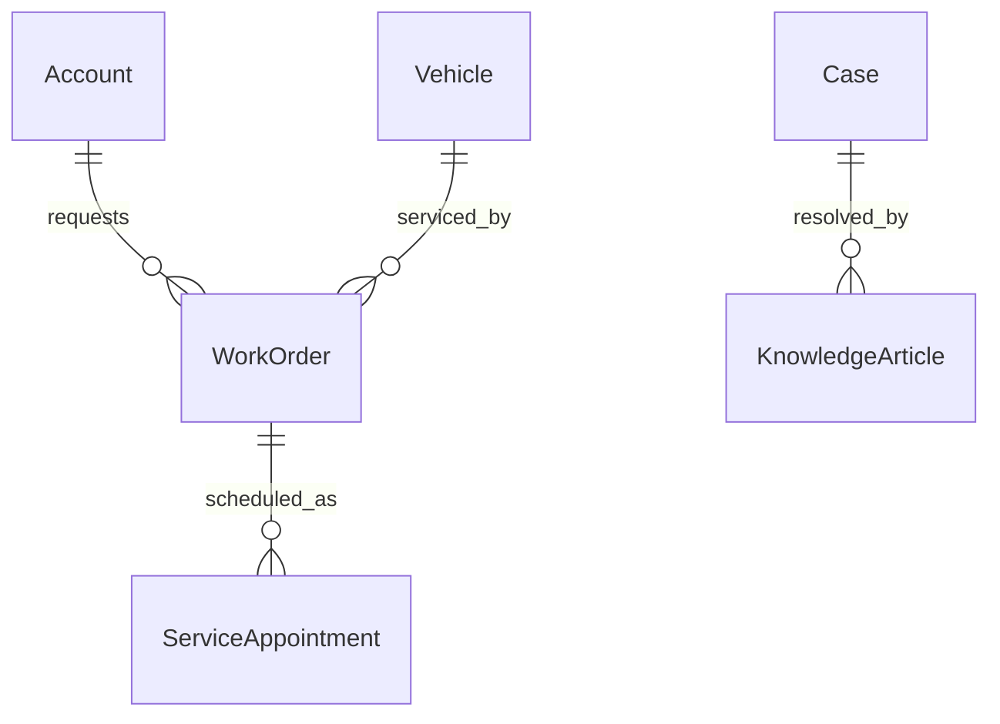
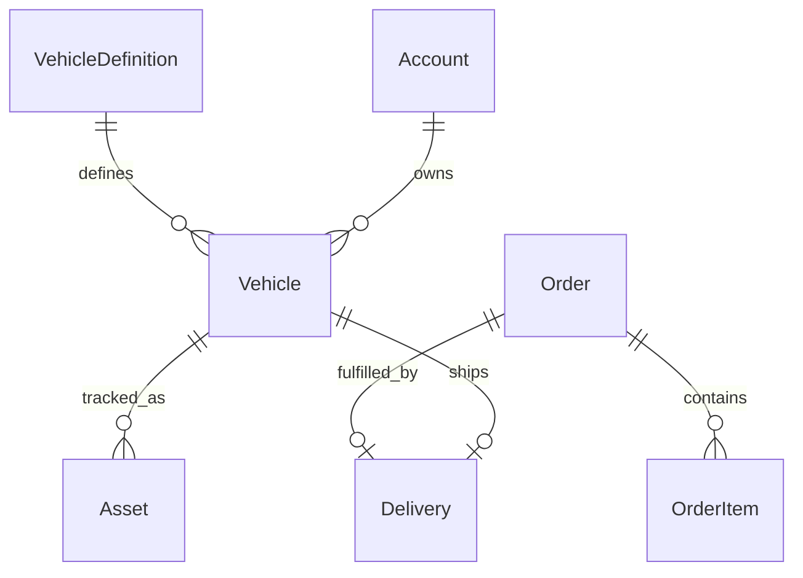

# Forcelet data model

Built by **Suresh Itha**. 24 standard objects, all definable at runtime.

## Core CRM

## Service

## Automotive (Auto Cloud style)

Vehicle lifecycle: `In Stock → Reserved → Sold → In Service → Delivered`.
Orders auto-number (`ORD-000001…`); activating an order auto-creates a
scheduled delivery; completing a delivery marks the vehicle delivered.

## Field types

Text, TextArea, Number, Currency, Date, DateTime, Checkbox, Picklist,
MultiPicklist, Lookup, Email, Phone, URL, Encrypted, Geolocation, Address,
Time.

- `Geolocation`: dict `{"latitude":…, "longitude":…}`, `[lat, lng]` pair, or
  `"lat;lng"` string; latitudes ±90, longitudes ±180; stored `lat;lng`.
- `Address`: compound street / city / state / postal_code / country, stored
  as JSON.
- `Time`: `HH:MM` or `HH:MM:SS`, normalized to `HH:MM:SS`.

Plus: formula fields, roll-up summaries (sum/avg/min/max/count with filters),
auto-number via triggers, external IDs with upsert.

## Relationships

Lookup fields are optional references. `MasterDetail` fields are always
required and carry relationship semantics:

- parent must exist on create/update;
- self-references and relationship cycles are rejected;
- deleting a parent recursively cascade-deletes its details (recycle bin +
  CDC events); bulk delete cascades too;
- `reparentable: false` blocks changing the parent afterwards;
- `sharing_inherits_master: true` makes detail visibility follow the master.

`GET /api/admin/relationships` lists every Lookup/MasterDetail relation.

## Person Accounts

One-time org enable (`POST /api/admin/person-accounts/enable`, irreversible):
adds `FirstName`, `LastName`, `PersonEmail`, `PersonPhone`,
`IsPersonAccount` to Account and the `PersonAccount` record type. Account
`Name` is derived from the person name on create/update.

## Territories

Territory hierarchy (`/api/admin/territories`) with cycle protection; users
are assigned to territories with roles, and an assignment covers descendant
territories. Assignment rules (`/api/admin/territory-rules`) pair expression
criteria with a territory, a priority, and an active flag; running assignment
rebuilds Account↔territory associations. Territory membership grants
visibility to Accounts and their Opportunities.

## Big Objects & archival

Big Objects (`__b`, `/api/admin/big-objects`) are append-only: inserts (API
and Bulk) succeed; updates and deletes are rejected with 422. Archive rules
(`/api/admin/archive-rules`) move records older than N days into a mirrored
`<Object>Archive__b` big object — source fields copied, `OriginalId`
preserved — then delete them from the source. Last run and moved count are
tracked per rule.

## App UI (record pages)

The end-user record UI surfaces the data-model features beyond Setup:

- **Record header**: every detail page now shows the record name; Person
  Accounts get a 👤 pill and Big Object records a "read-only" pill.
- **Related tab**: Lookup *and* Master-Detail children appear with a type
  badge, a "View all (N)" full-list view, and a "+ New" button that opens the
  child form with the parent pre-selected.
- **Details tab**: Lookup/MasterDetail fields render as links to the parent
  record; MasterDetail fields carry an M-D badge; Geolocation shows
  `lat, lng` with a 🗺️ map link; Address renders as formatted lines; Time
  shows `HH:MM:SS`.
- **Person card**: Person Account records show a 👤 Person card (name, email,
  phone) above the details; creating an Account with the `PersonAccount`
  record type auto-sets `IsPersonAccount` and derives `Name`.
- **Territories card**: Account and Opportunity records list their assigned
  territories (`/api/sobjects/Account/<id>/territories`).
- **Big Objects**: object tabs open a read-only browser (New/insert allowed;
  inline edit, Edit and Delete hidden); Setup's Big Objects and archive-rule
  lists link straight to "View records" / "View archived".
- **Forms**: MasterDetail renders as a required parent picker; Geolocation as
  lat/lng inputs; Address as street/city/state/postal/country inputs; Time as
  a time picker.

## Automation inventory (seeded)

| Kind | Examples |
|---|---|
| Triggers (code) | Order/delivery/contract/work-order/article numbering, VIN validation, lead stage→probability, block account delete with open opps |
| Validation rules | Contract dates, event end ≥ start, delivery dates, VIN length |
| Flows | Order activation → delivery; appointment completion → work order completion; delivery completion → vehicle delivered |
| Approval processes | Discount approval (seeded) |
| Paths | Vehicle lifecycle, order fulfillment, work order service |
| Assignment | Round-robin web leads |
| Scheduled jobs | Close-date reminders, case SLA monitor |
| Duplicate rules | Lead email, VIN |
| Sharing rules | Criteria-based (seeded examples) |
| SLA policies | First-response / resolution targets by priority, breach escalation |
